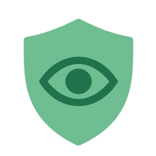
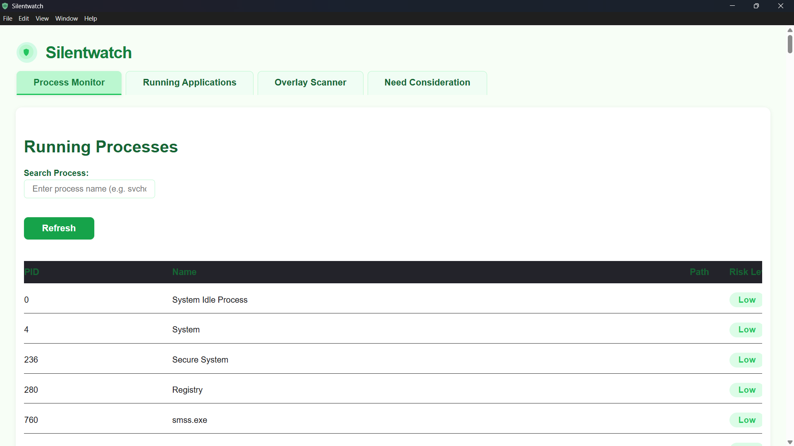
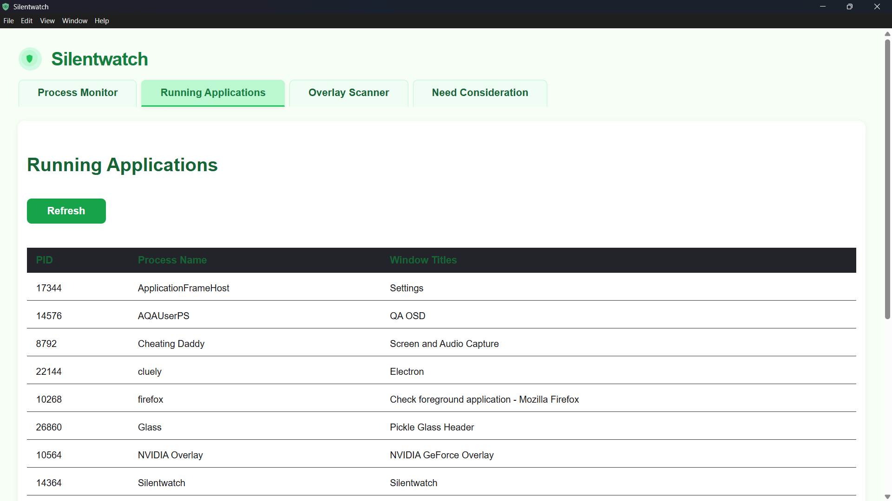
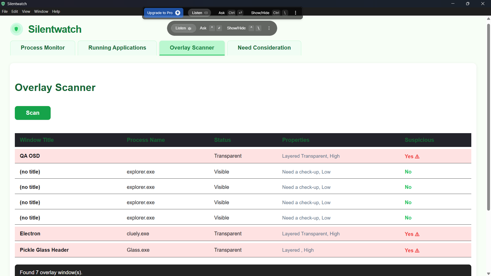
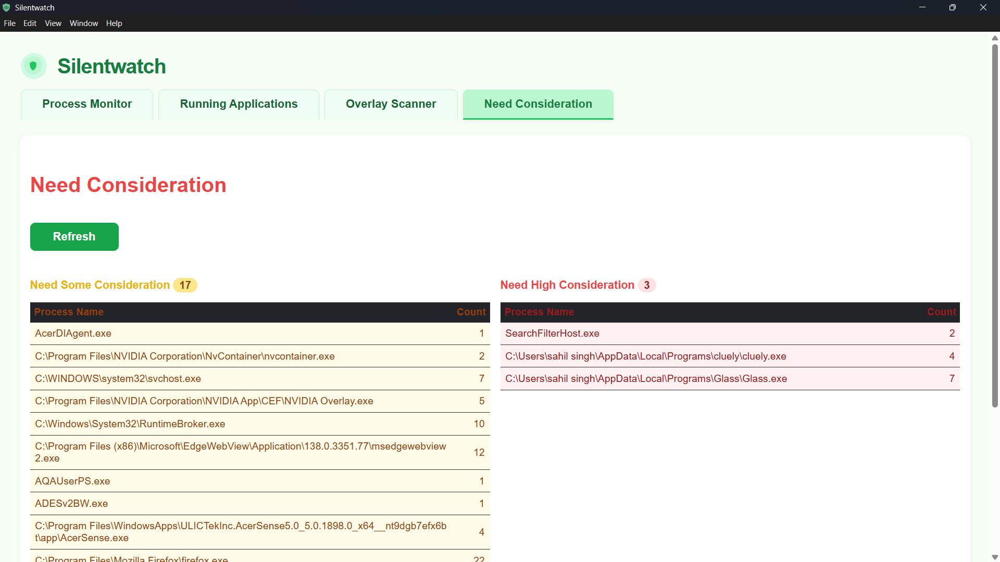

# Silentwatch



A powerful system monitoring application built with Electron and React, specifically designed to detect and prevent cheating tools and hacking utilities.

## Key Capabilities

- Detects and flags popular cheating tools:
  - Cludely
  - Glass
  - Cheating Daddy
  - Limitless
  - Photomath
  - WolframAlpha
  - And many other suspicious utilities

- Monitors for hidden overlays and screen capturing tools commonly used in cheating
- Uses sophisticated risk assessment to identify suspicious processes
- Provides real-time alerts for potential cheating attempts

## Screenshots

### Process Monitor

- Detailed process information
- Search and filter capabilities
- Risk assessment scores

### Running Applications

- List of all active applications
- Real-time updates of running programs

### Overlay Scanner

- Hidden window detection
- Overlay scanning results
- Real-time updates

### Need Consideration

- List of suspicious processes
- Detailed risk information

## Prerequisites

Before running Silentwatch, ensure you have the following installed:

- Node.js (version 16 or higher)
- npm (Node Package Manager)
- Git
- Windows operating system (required for process monitoring)
- Visual Studio Build Tools with C++ Development Kit:
  - Download from Microsoft Visual Studio website
  - During installation, select "Desktop development with C++" workload
  - Make sure to install the Windows 10 SDK
- Python 3.8 or higher (for process monitoring utilities)
- Windows PowerShell 5.1 or higher
- Windows Management Framework (WMF) 5.1

## Additional Dependencies

1. Install Python dependencies:
```bash
pip install wmi
pip install psutil
```

2. Install Windows Management Framework (WMF) 5.1:
- Download from Microsoft's official website
- Run the installer as Administrator

3. Install Windows PowerShell:
- Should come pre-installed with Windows 10/11
- Verify version using: `powershell -version`

4. Install WMI (Windows Management Instrumentation):
- Should be pre-installed with Windows
- Verify using: `wmic os get version`

## Installation

1. Clone the repository:
```bash
git clone [repository-url]
cd silentwatch
```

2. Install Node.js dependencies:
```bash
npm install
```

3. Install Electron dependencies:
```bash
npm install electron --save-dev
npm install electron-builder --save-dev
```

4. Install UI dependencies:
```bash
npm install @radix-ui/react-accordion
npm install @radix-ui/react-tabs
npm install @radix-ui/react-toast
npm install lucide-react
```

3. Build the application:
```bash
npm run build
```

## Running the Application

### Development Mode
To run in development mode:
```bash
npm run dev
```
This will start both the Electron application and the development server.

### Production Mode
To create a production build:
```bash
npm run build
npm run start
```

## Project Structure

```
silentwatch/
├── src/
│   ├── app/          # React application code
│   ├── components/    # React components
│   └── lib/          # Utility functions and monitoring logic
├── public/           # Static assets
└── package.json      # Project dependencies
```

## Features

- Real-time process monitoring with cheating detection
- Advanced overlay detection (catches screen capture tools)
- Comprehensive risk assessment system
- Modern UI with intuitive monitoring views
- Need consideration list for suspicious processes
- Automatic detection of known cheating tools and utilities

## Security Note

This application requires administrative privileges to monitor system processes effectively. Make sure to run it with appropriate permissions.

## Contributing

1. Fork the repository
2. Create your feature branch (`git checkout -b feature/AmazingFeature`)
3. Commit your changes (`git commit -m 'Add some AmazingFeature'`)
4. Push to the branch (`git push origin feature/AmazingFeature`)
5. Open a Pull Request

## License

This project is licensed under the MIT License - see the LICENSE file for details.